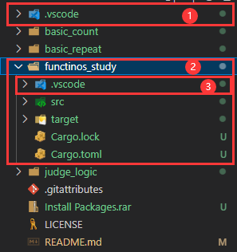
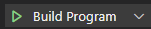

# Rust-study
 *This repository is for Rust learners to study the basic use of some Rust grammar, and with the explanations in the source code you could know what the beneath code is for.*

## Packages provide (Update at 2023.09.16) - For Windows User

> More information please check up in the official website: [https://www.rust-lang.org/tools](https://www.rust-lang.org/tools)

In the root directory, I put two necessary tool in a `.rar` file, and you could unpack it to get the tools.

In the tool set, there are two useful tool that I think it would help a lot when you want to start studying Rust.

1. cargo init setup program - a inside package controller.
2. `link.exe` install package - most common errors will show on at the first running. More help information please check up in [VS Code Rust Help](https://code.visualstudio.com/docs/languages/rust#_common-questions) (If you use VS Code as your main code editor.)

## Run Rust code


### Copy task files

Before you run Rust code, please make sure that you have copied the `.vscode` folder into your code root folder.



For example, In this picture, the number one folder is original `.vscode` folder, and you couldn't use it to run any code in this root folder.

You should copy the number one folder into number two folder, which is created by yourself with command line as the beneath.

```shell
cargo new <folder-name>
```

And after the copy action, you will certainly see the `.vscode` folder is inside of `<folder-name>` folder.

### Run Rust code

Locate your source code root folder in your system file explorer, and use VScode to open the source code root folder.

At the left sidebar of VScode, click `run & debug` button as the icon 

Then you will see three mode of the `run & debug` action

- `Build Program` - Build the Rust source code.
- `Format Sources` - Make your source code looks pretier.
- `Optimize Source` - To get some optimize advice on your source code.



Then select the right mode and cllick the `Run` button at the left of the select box, then you will see the result shows in your VScode inside command.

## Program Introduction

|   **Folder Name**   	|              **Description**             	| **Create Date** 	|
|:-------------------:	|:----------------------------------------:	|:---------------:	|
|   **basic_count**   	| Hello world with simple number calculate 	|    2023-09-16   	|
|   **basic_repeat**  	|          Repeat methods examples         	|    2023-09-16   	|
|   **judge_logic**   	|      If & else grammar with judging      	|    2023-09-16   	|
| **functions_study** 	|      Custom functions demonstration      	|    2023-09-16   	|

## Contributors

<a href="https://github.com/lipeilin375/rust-study">
  
</a>

Made with [contrib.rocks](https://contrib.rocks).